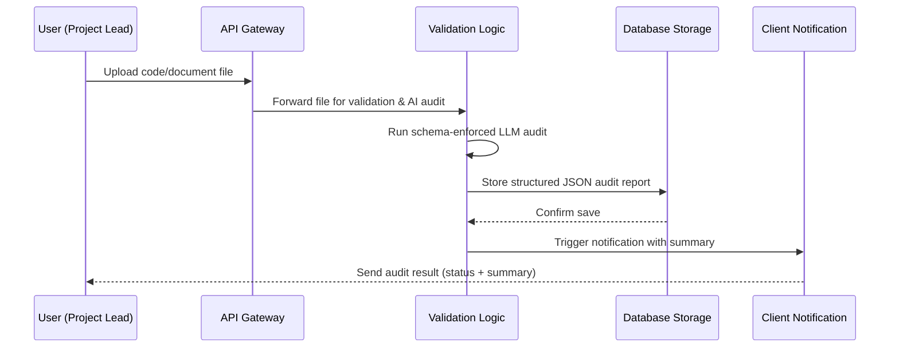

# Task 3 – Business Analysis & Process Mapping

## Part 1: User Stories (Given / When / Then)

### Story 1 — Non-technical Project Lead submits code for auditing

| | |
|---|---|
| **Given** | A Project Lead is logged into the audit dashboard, with no coding background |
| **When** | They upload a code file or document through the web upload screen |
| **Then** | The system accepts the file, confirms receipt, starts the AI audit automatically, and displays a simple "Audit in progress" status with no technical jargon required |

```gherkin
Feature: Submit code or documents for automated audit

Scenario: Project Lead submits a file without needing technical knowledge
  Given a Project Lead is logged into the audit dashboard
  And they do not have a coding background
  When they upload a code file or document through the web upload screen
  Then the system accepts the file and confirms it was received
  And the system automatically starts the AI audit in the background
  And the Project Lead sees a simple "Audit in progress" status,
    with no technical jargon required to understand what's happening
```

---

### Story 2 — System detects a Critical security risk and halts deployment

| | |
|---|---|
| **Given** | A code audit has completed for a submitted file |
| **When** | The audit report contains at least one issue marked "Critical" severity |
| **Then** | The deployment pipeline is automatically stopped, the responsible team is notified immediately, and deployment cannot continue until the issue is resolved or an authorized person approves an override |

```gherkin
Feature: Block deployment when a critical security issue is found

Scenario: A Critical severity issue halts the pipeline
  Given a code audit has completed for a submitted file
  When the audit report contains at least one issue marked "Critical" severity
  Then the deployment pipeline is automatically stopped before release
  And the responsible engineering team is notified immediately
  And the deployment cannot continue until the Critical issue is resolved
    or an authorized person manually approves an override
```

---

### Story 3 — Team manager exports the audit summary to a dashboard

| | |
|---|---|
| **Given** | A completed audit report exists in JSON format |
| **When** | A team manager selects "Export to Dashboard" |
| **Then** | The summary, issue counts, and severities are sent to the executive dashboard, while raw technical detail remains available on request |

```gherkin
Feature: Export audit results for executive visibility

Scenario: Team manager exports the JSON summary to a dashboard
  Given a completed audit report exists in JSON format
  When a team manager selects "Export to Dashboard"
  Then the summary, issue counts, and severities are sent to the
    executive dashboard
  And the raw technical details remain available on request,
    without cluttering the main dashboard view
```

---

## Part 2: Process Map



| Stage | Responsibility |
|---|---|
| User Upload | User submits a code or document file via the web interface |
| API Gateway | Receives the request and routes it securely to backend services |
| Validation Logic | Executes the schema-enforced LLM audit (`audit.py`) and validates the response against the defined JSON schema |
| Database Storage | Persists the validated audit report for historical tracking and dashboard access |
| Client Notification | Notifies the submitter and relevant stakeholders once the audit is complete |
