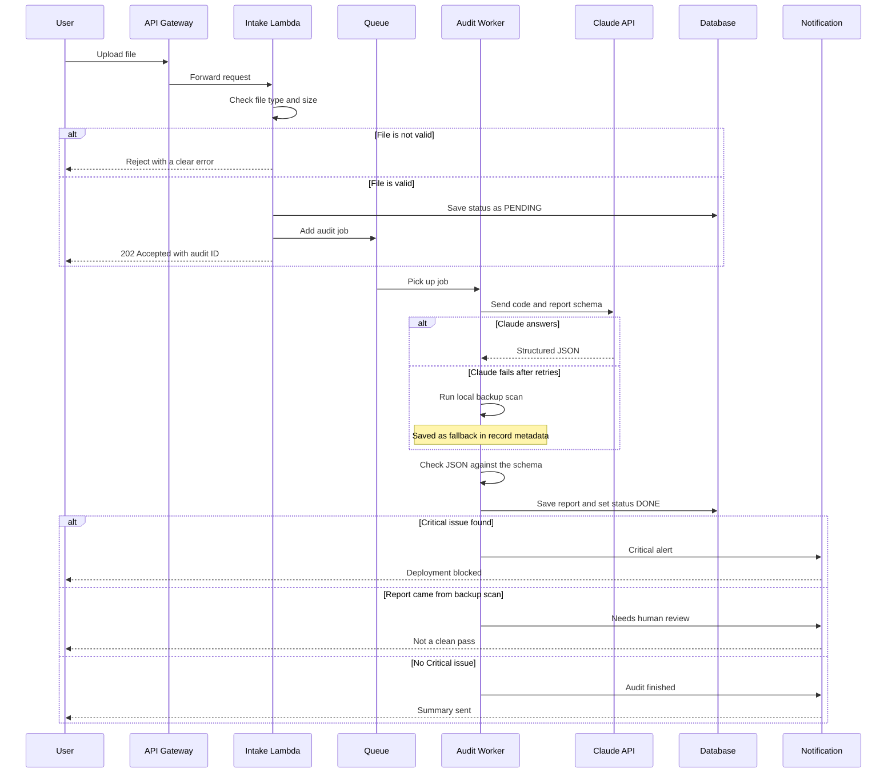

# Task 3 – Business Analysis & Process Mapping

## Part 1: User Stories

### Story 1: A Project Lead submits code for auditing

**As a** non-technical Project Lead
**I want** to upload a file and see when the audit is done
**So that** I know the work was checked without needing to read code.

```gherkin
Feature: Submit code or documents for automated audit

  Scenario: Project Lead uploads a valid file
    Given a Project Lead is logged in to the audit dashboard
    When they upload a code file or document
    Then the system confirms the file was received
    And the audit starts automatically in the background
    And the Project Lead sees a plain "Audit in progress" status

  Scenario: Project Lead uploads a file that is not allowed
    Given a Project Lead is logged in to the audit dashboard
    When they upload a file that is too large or the wrong type
    Then the system rejects the file
    And shows a clear message saying what to fix
```

### Story 2: A Critical security risk stops deployment

**As an** engineering manager
**I want** the pipeline to stop when a Critical issue is found
**So that** risky code never reaches production.

```gherkin
Feature: Block deployment when a Critical issue is found

  Scenario: Audit finds a Critical issue
    Given an audit has finished for a submitted file
    When the report contains at least one Critical issue
    Then the deployment pipeline is stopped before release
    And the engineering team is notified straight away
    And deployment stays blocked until the issue is fixed or an authorized person approves an override

  Scenario: Report came from the backup scanner with no Critical issue
    Given the AI provider failed and the local backup scanner produced the report
    When the report contains no Critical issue
    Then the pipeline marks the result as "needs human review"
    And the result is not counted as a clean pass
```

### Story 3: A manager exports the audit summary to a dashboard

**As a** team manager
**I want** to send the audit summary to the executive dashboard
**So that** leaders can see code health without reading technical detail.

```gherkin
Feature: Export audit results for executives

  Scenario: Manager exports a finished audit
    Given a finished audit report exists
    When the team manager selects "Export to Dashboard"
    Then the summary, issue counts and severities appear on the executive dashboard
    And the full technical details stay available on request
```

---

## Part 2: Process Map

Flow: **User Upload → API Gateway → Validation Logic → Database Storage → Client Notification**



| Stage | What happens |
|---|---|
| User Upload | User sends a file from the web page or from a CI pipeline. |
| API Gateway | Checks who is calling, limits request rates, passes the request on. |
| Validation Logic | Two checks. **Input check:** file type and size, before anything is sent to the AI. **Output check:** the AI answer must match the report schema (Pydantic). Bad answers are retried, then the backup scan runs. |
| Database Storage | Saves the report, the status (PENDING, DONE, FAILED) and whether it came from the AI or the backup scan. |
| Client Notification | Tells the user the result. Critical issues send an alert and block the pipeline. |

**Why a queue?** An audit can take longer than an API request is allowed to wait. So the user gets an immediate "received" answer and the audit runs in the background. This is also what shows the "Audit in progress" status in Story 1.
