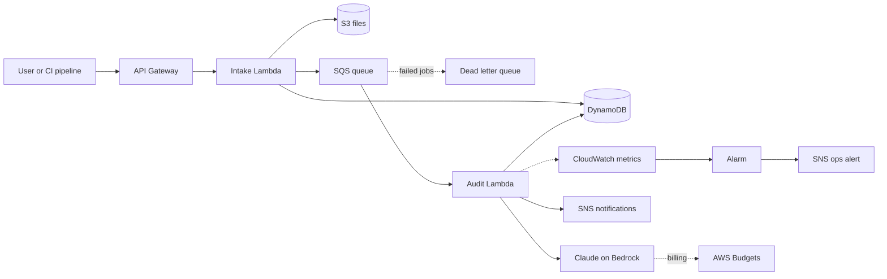

# Task 4 – AWS Cloud Architecture Summary

Goal: move the audit tool from a local script to a managed service on AWS for an enterprise client.

## 1. Serverless stack

| Service | Job | Why |
|---|---|---|
| **API Gateway** | Front door. Checks who is calling and limits request rates | No server to run. Blocks anonymous and abusive traffic early |
| **Intake Lambda** | Checks file type and size, saves the file, queues the job, replies "202 accepted" | Fast reply. The user never waits for the AI |
| **SQS + dead letter queue** | Holds audit jobs. Jobs that keep failing go to the dead letter queue | Audits can outlast API Gateway's 29 second wait. The queue also absorbs bursts and keeps failed jobs for review |
| **Audit Lambda** | Runs the `audit.py` logic: call Claude, check the JSON, use the backup scan if needed | Pay only when an audit runs. Scales up on its own |
| **S3** | Stores uploaded files and reports (versioned, encrypted) | Cheap, durable, gives an audit trail |
| **DynamoDB** | Stores status and report per audit ID | Reports are already JSON and are read by simple key lookups |
| **SNS** | Sends "done", "Critical" and "needs review" messages | Email, Slack and dashboards can subscribe without code changes |

At larger scale, Step Functions can replace the retry and backup logic inside the Audit Lambda.

## 2. Secrets and security

**Recommended: Claude on Amazon Bedrock.** There is no API key to store. The Audit Lambda uses an IAM role that allows `bedrock:InvokeModel` for one model only. The client's code stays inside their AWS account. The one code change is swapping the Anthropic client for the Bedrock client.

**If we keep the direct Anthropic API (as in the demo):**
- The key lives in **Secrets Manager**, never in code or plain environment variables.
- Anthropic keys are made in the Anthropic console, so rotation is a short planned step: create a new key, update the secret, delete the old key. A CloudWatch alarm fires if the secret is older than 90 days. (Check Anthropic's current docs before promising full automatic rotation.)
- Settings that are not secret (model name, retry count) go in **Parameter Store**.

**Least-privilege IAM (both options):** each Lambda gets only what it needs, on exact resources, with no `*`:
- Secrets read (or Bedrock invoke) for one secret or one model
- DynamoDB read and write on one table
- S3 read and write on one bucket prefix
- SQS send or receive on one queue

**Encryption and access:** TLS on API Gateway. S3 and DynamoDB encrypted at rest. API Gateway uses IAM or Cognito login, so nobody can call it anonymously.

## 3. Cost and token governance

- **Log tokens.** The Audit Lambda writes input and output token counts to a custom CloudWatch metric after every call. Bedrock also reports its own token metrics.
- **Alarm on spikes.** A CloudWatch alarm fires if daily tokens go above twice the 7-day average. It sends an SNS alert to the engineering lead.
- **Budgets.** AWS Budgets alerts at 50%, 80% and 100% of the monthly budget. With Bedrock, Claude usage is on the AWS bill, so Budgets sees it. **With the direct Anthropic API it does not**, so set a monthly spend limit in the Anthropic console too.
- **Hard limits, not only alerts:**
  - Max file size, enforced in the Intake Lambda
  - `max_tokens` cap on every call
  - Lambda reserved concurrency, so a flood cannot run up the bill
  - API Gateway usage plans and rate limits per client
  - Dead letter queue, so failing jobs do not retry forever

Alarms tell us when something is off. Limits stop it from getting expensive.
