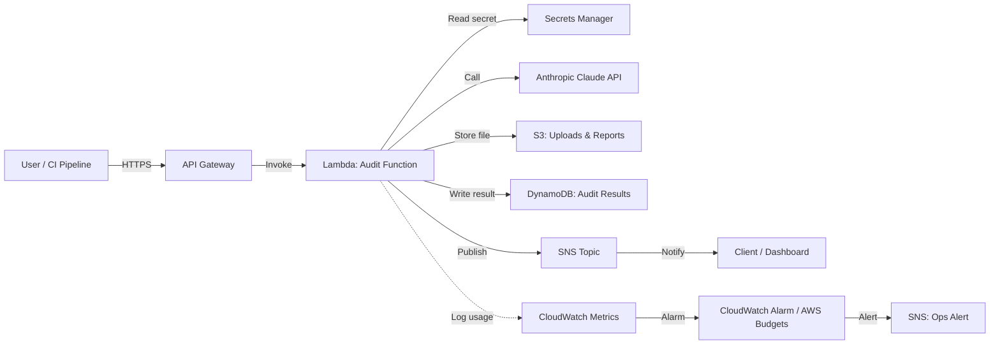

# Task 4 – AWS Cloud Architecture Summary

## Overview

This document outlines how the automated code audit tool would be deployed
on AWS for an enterprise client, moving from the current local CLI script
to a fully managed, serverless service.

## 1. Serverless Stack

| Service | Role in this architecture | Why it was chosen |
|---|---|---|
| **Amazon API Gateway** | Public entry point that receives audit requests (file uploads or CI pipeline calls) over HTTPS | Handles authentication, request throttling, and request validation before anything reaches compute, without needing a managed server to sit in front of the application |
| **AWS Lambda** | Runs the audit logic (the same core logic as `audit.py`): builds the prompt, calls the Claude API, validates the response against the schema, and applies the local fallback if needed | Audit requests are bursty and unpredictable rather than constant, so paying only per-invocation is far more cost-effective than running an always-on server. Lambda also scales automatically if many files are submitted at once (e.g. a large batch of pull requests) |
| **Amazon S3** | Stores the original submitted files and the resulting JSON audit reports, using a versioned, encrypted bucket | Durable, cheap, effectively infinite storage, and a natural audit trail — every submission and its result is retained and versioned automatically |
| **Amazon DynamoDB** | Stores structured audit results (summary, issues, severities) indexed by submission ID and timestamp, for fast retrieval by the dashboard | A serverless, auto-scaling NoSQL database is a strong fit here because the audit report is already structured JSON (matching our Pydantic schema) with no complex relational joins required, and query patterns are simple key lookups |
| **Amazon SNS** | Publishes notifications once an audit completes, fanning out to email, Slack, or the client dashboard | Decouples the "audit finished" event from however each team wants to be notified, without hardcoding notification logic into the Lambda function itself |
| **AWS Step Functions** *(optional, at scale)* | Orchestrates the multi-step audit flow (call primary provider → validate → retry → fallback → store → notify) as a visual, resumable state machine | As the fallback logic from Task 2 grows more complex, moving it out of a single Lambda function into Step Functions makes each step individually retryable, observable, and easier to debug than nested try/except blocks |

This stack is fully serverless: there are no EC2 instances or containers to patch, provision, or scale manually, which suits a small engineering team supporting an internal tool.

## 2. Secrets & Security

**Storing the API key**
The Anthropic API key is stored in **AWS Secrets Manager**, not in code, environment variables baked into the Lambda deployment, or Parameter Store. Secrets Manager was chosen over Parameter Store specifically because it supports **automatic rotation** — a rotation Lambda can periodically request a new key and update the secret without any manual intervention or downtime, which matters for a credential with this level of access. Non-sensitive configuration values (e.g. the model name, retry counts) are still kept in **Systems Manager Parameter Store**, since they don't need rotation and Parameter Store is the cheaper option for plain configuration.

**Access control**
The Lambda function is granted a dedicated **IAM execution role** scoped to the principle of least privilege:
- `secretsmanager:GetSecretValue` restricted to the exact ARN of the Anthropic API key secret, not `*`
- `dynamodb:PutItem` / `GetItem` restricted to the single audit-results table
- `s3:GetObject` / `PutObject` restricted to the specific bucket and prefix used for this application

No wildcard permissions are granted, so that even if the Lambda function itself were somehow compromised, the blast radius is limited to exactly the resources this function needs.

**Encryption**
- Data in transit is encrypted via TLS, enforced at the API Gateway layer.
- Data at rest is encrypted using S3 server-side encryption (SSE-S3 or SSE-KMS) and DynamoDB's built-in encryption at rest.
- API Gateway requires an authorizer (IAM auth or Amazon Cognito, depending on whether internal or external users are calling it) so the endpoint cannot be invoked anonymously.

## 3. Cost & Token Governance

LLM usage is billed per token, which makes it a cost line that can spike quickly and unexpectedly if usage patterns change (for example, a much larger file being submitted, or a bug causing repeated retries). This architecture treats token spend as something to actively monitor, not just react to after the invoice arrives.

**Monitoring**
- After each Claude API call, the Lambda function logs the input/output token counts returned by the API as a **custom CloudWatch metric** (e.g. `AuditTool/TokensUsed`).
- A **CloudWatch Dashboard** visualizes daily and weekly token usage trends, so the team can see gradual drift, not just sudden spikes.

**Alerting**
- A **CloudWatch Alarm** is configured against the token-usage metric with a defined threshold (e.g. more than double the rolling 7-day average in a single day). When triggered, it publishes to an **SNS topic** that notifies the engineering lead via email or Slack.
- Separately, **AWS Budgets** is configured with a monthly dollar threshold for overall AWS spend tied to this service, with alerts firing at 50%, 80%, and 100% of the budget — this catches broader infrastructure cost creep (Lambda invocations, S3 storage, DynamoDB throughput), not just LLM token spend specifically.

Together, these give the team two independent layers of protection: one that catches unusual *usage patterns* early (token-level alarm), and one that catches unusual *spend* regardless of the cause (account-level budget alert).
